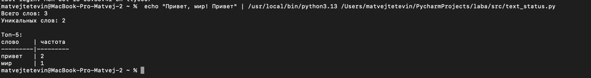

``` 
задания A и B код и тест кейсы для B
```

# задание A
```python
import re

def normalize(text: str, *, casefold: bool = True, yo2e: bool = True) -> str:
    if casefold:
        text = text.casefold()
    if yo2e:
        text = text.replace("ё", "е")
        text = text.replace("Ё", "Е")
    text = text.replace("\t", " ").replace("\n", " ").replace("\r", " ")
    text = text.strip()
    return text

def tokenize(text: str) -> list[str]:
    return re.findall(r'[a-zA-Zа-яА-ЯёЁ]+', text)

def count_freq(tokens: list[str]) -> dict[str, int]:
    freq_dict = {}
    for token in tokens:
        freq_dict[token] = freq_dict.get(token, 0) + 1
    return freq_dict

def top_n(freq: dict[str, int], n: int = 5) -> list[tuple[str, int]]:
    """Вернуть топ-N по убыванию частоты; при равенстве — по алфавиту слова"""
    items = list(freq.items())
    items.sort(key=lambda item: (-item[1], item[0]))
    return items[:n]
```

# задание B
```python
from lib.text import normalize,tokenize,count_freq,top_n
import sys


def main():
    text = sys.stdin.read()

    if not text.strip():
        print("Нет входных данных")
        return


    normalized_text = normalize(text)
    tokens = tokenize(normalized_text)


    total_words = len(tokens)
    freq_dict = count_freq(tokens)
    unique_words = len(freq_dict)
    top_words = top_n(freq_dict, 5)
    print(f"Всего слов: {total_words}")
    print(f"Уникальных слов: {unique_words}")
    if top_words:
        max_word_length = max(len(word) for word, count in top_words)
        column_width = max(max_word_length, 8)

        print("\nТоп-5:")
        print("слово".ljust(column_width) + " | частота")
        print("-" * column_width + "-|---------")

        for word, count in top_words:
            print(word.ljust(column_width) + f" | {count}")
    else:
        print("\nТоп-5: нет слов для отображения")


if __name__ == "__main__":
    main()
```

# Некий пруф:

